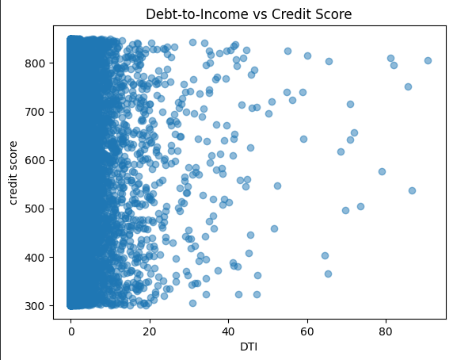
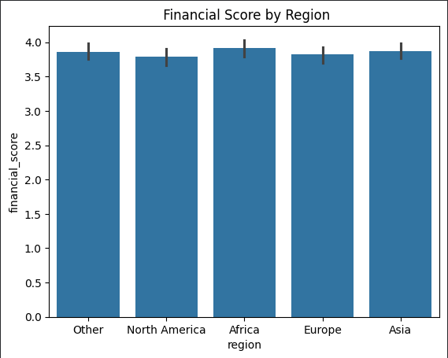
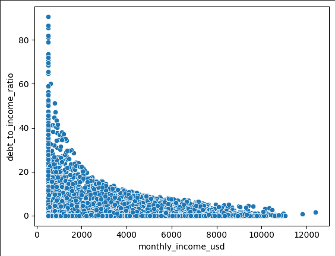

# Personal-Finance-Analytics-Income-Savings-Credit-Risk-Analysis
### 📌 Project Overview
This project performs an end-to-end financial data analysis to understand how individuals manage income, expenses, savings, debt, and credit risk.
Using SQL, Pandas, and Data Visualization, the project extracts actionable insights that can help financial institutions, fintech platforms, and analysts make data-driven decisions.

The analysis focuses on:
- Financial wellness
- Spending behavior
- Debt and credit risk
- Customer segmentation
- Time-based financial trends

## 🎯 Objectives
- Analyze the relationship between income and expenses
- Evaluate savings behavior and financial wellness
- Identify high-risk borrowers using debt and credit metrics
- Segment users into business-friendly financial personas
- Visualize trends and patterns for better decision-making

## 🗂 Dataset Description
- Source: Synthetic Personal Finance Dataset
- Size: ~32,000+ records
- Key Features:
  - Demographics: age, gender, education, region, job title
  - Financials: income, expenses, savings
  - Loans: loan type, EMI, interest rate
  - Risk Metrics: credit score, debt-to-income ratio
  - Time dimension: record_date

 ## 🛠 Tools & Technologies
- **SQL (PostgreSQL)** – Data cleaning, validation, and analytical queries
- **Python (Pandas, NumPy)** – Data manipulation and feature engineering
- **Matplotlib & Seaborn** – Data visualization and dashboard-style analysis
- **Jupyter Notebook** – Interactive analysis and storytelling
- **GitHub** – Version control and project presentation

## 📁 Project Structure
```
Finance-Analytics-Project/
│
├── data/
│   └── synthetic_personal_finance_dataset.csv
│
├── notebooks/
│   ├── cleaning_eda_featureEngineering.ipynb
│   ├── visualization_and_insights.ipynb
│
├── sql/
│   ├── 01_data exploration queries.sql
│   ├── 02_data cleaning queries.sql
│   ├── 03_business insights queries.sql
|   ├── schema.sql
|   └── staging_finance_raw.sql
│
├── images/
│   └── dashboard_visuals.png
│
├── README.md
└── requirements.txt
```
## 🔍 Key Analysis Performed
### 🧹 Data Cleaning & Validation
- Handled missing and inconsistent values
- Validated financial ranges (credit score, income, expenses)
- Ensured data integrity across users, loans, and regions

### 📊 Exploratory Data Analysis
- Income and expense distribution
- Demographic insights by region, education, and employment
- Savings patterns across age and income groups

### 💳 Debt & Credit Risk Analysis
- Debt-to-income (DTI) risk segmentation
- EMI affordability analysis
- Credit score profiling and trends

### 🧠 Feature Engineering
- Spending ratio
- Net savings
- EMI burden
- Financial wellness score
- Customer risk segmentation

### 📈 Visualization & Dashboard Insights
- Income vs Expense analysis
- Savings and wellness comparison
- Credit score vs debt risk
- Regional and time-based financial trends

## 📌 Sample Business Insights
- Higher income users show greater spending variability, indicating diverse lifestyle choices.
  
- A significant portion of users operate close to the income-expense breakeven point, limiting savings.
  
- Debt-to-income(DTI) ratio alone does not linearly determine credit score.
  
- Financial wellness Score varies by region, driven by savings discipline and debt exposure.
  
- Customer segmentation reveals clear groups such as “Wealthy – Low Risk” and “Low Income – High Risk”.
  
